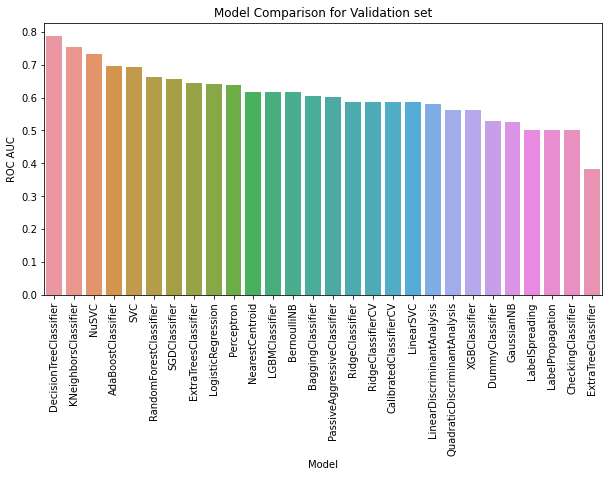
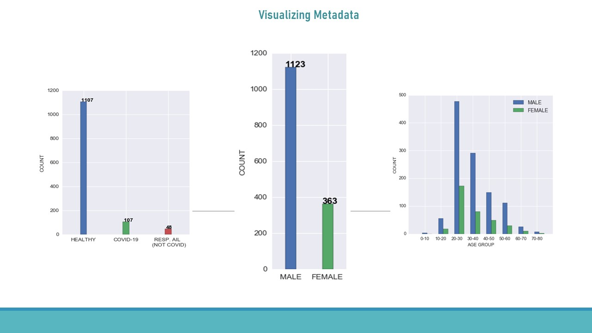
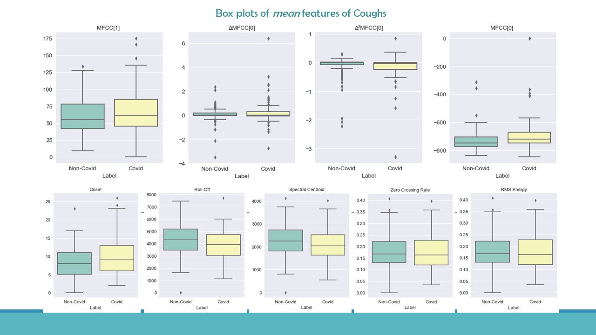

# Diagnose-Covid-19-from-Respiratory-Sound

This repository contains implementation of Automatic Diagnosis of Covid-19 from respiratory sound data which is inspried by the research of [University of Cambridge](https://covid-19-sounds.org/en/) on this.[Click here](https://arxiv.org/abs/2006.05919) to have a look on the research paper.

# My Work
                                  
   * [MetaData Visualizaion](notebooks/visualization/metadata_visualization.ipynb) Visualizes the meta-information of the dataset.
                                  
                                  
   * [Extracting Features](notebooks/feature_extraction_and_modelling.ipynb) Extracting 730-dimension feature from raw audio input.
                                  
                                  
   * [Features Visualization](notebooks/visualization/features_visualization.ipynb) Visualizes the mean-features of the coughs.
                                  
                                  
   * [Model Comparison](notebooks/model_comparison.ipynb) Compares between different models.
   
I have used many helper function in the notebooks that I have defined earlier. You will find all the pre-defined helper functiom [here](helper/).

# Background
Research has now started to use digital technology to gather respiratory sound, which could then be used for automatic analysis using Artificial Intelligence. Such a research by University of Cambridge, shows promise in detecting diagnostic signals of Covid-19 from voice and coughs. Inspired by this work, I tried to diagnose of Covid-19 from coughs which gives AOC of 79%.[Click here](notebooks/model_comparison.ipynb) to look different model's performance.

# Data Collection
For this project I used the data of [Project Cowsara](https://coswara.iisc.ac.in/) of IISc Bangalore which is a attempt to build a diagnostic tool based on respiratory cough and speech sound. For now, I only used the cough data. [Click here](notebooks/visualization/metadata_visualization.ipynb) to look at the metadata with visualization.

# Project Description
This data has a huge class imbalance having significantly low positive input.After undersampling negative inputs, used VGGish as transfer learning to create 256-dimension feature which is based on spectrogram input. Despite being missed any temporal characteristics, created another 474-dimension handcrafted features. 730-dimension features further reduced by PCA retaining a portion of initial variance explained.[Click here](notebooks/visualization/feature_visualization.ipynb) to look at the different feature's visalization.

